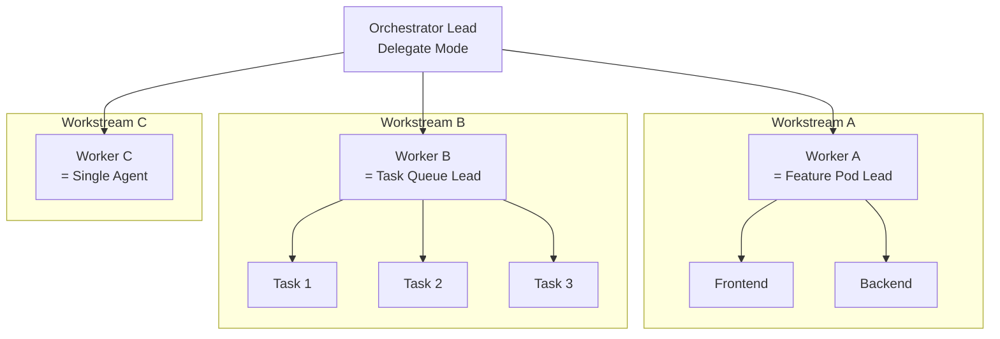

# Composing Topologies

Topologies are primitives, not monoliths. Any teammate slot in a topology is just a Claude Code instance -- and that instance can itself run any pattern. Quality-Gated showed this first as an explicit overlay, but the principle is general: you can chain topologies in sequence (pipeline), nest them inside each other, or combine both.

## The principle

Every teammate "slot" in a topology -- explorer, reviewer, worker, investigator -- is a Claude Code instance with its own context window. That instance can fan out sub-explorers, spawn a review board, or gate its own work with hooks. Composition happens naturally because topologies describe **team shapes**, not rigid configurations.

Three composition patterns:

1. **Nesting** -- a teammate slot runs its own topology internally (Feature Pod reviewer spawns a Review Board)
2. **Pipelining** -- one topology's output feeds the next topology's input (Explorers → Hypotheses)
3. **Overlaying** -- a topology layers on top of another (Quality-Gated on anything)

The recipes below show concrete examples of each.

---

## Recipe 1: Feature Pod + Review Board

**Scenario:** Ship a full-stack feature, then review each layer through specialist lenses.

**Shape:** Feature Pod runs FE/BE/QA in parallel → on completion, lead spawns a Review Board where each reviewer gets one layer's output.

```mermaid
graph LR
    subgraph Phase 1: Build
        Lead1[Lead] --> FE[Frontend]
        Lead1 --> BE[Backend]
        Lead1 --> QA[QA]
    end

    subgraph Phase 2: Review
        Lead2[Lead] --> SecRev[Security<br/>Reviewer]
        Lead2 --> PerfRev[Performance<br/>Reviewer]
        Lead2 --> TestRev[Test<br/>Reviewer]
    end

    Phase 1: Build -->|"integration complete"| Phase 2: Review
```

**Spawn prompt:**

```text
Create an agent team to implement <feature>.

Phase 1 — Feature Pod:
- Frontend teammate: UI + state + integration points
- Backend teammate: API + data model + validations
- QA teammate: tests, edge cases, verification script
First task: define the contract (API, payloads, acceptance criteria).
Parallelize implementation by layer and reconverge for integration.

Phase 2 — Review Board (after integration passes):
Spawn three reviewers:
- Security implications across all layers
- Performance impact (queries, bundle size, API latency)
- Test coverage & correctness
Synthesize into a single review with must-fix vs nice-to-have.
```

**Why compose here:** The Feature Pod gets the feature built fast, but a single reviewer would miss cross-cutting concerns. The Review Board ensures each layer gets scrutinized through distinct lenses before the work ships.

---

## Recipe 2: Parallel Explorers → Competing Hypotheses

**Scenario:** Explore an unfamiliar codebase, then debate the best architectural approach based on what you find.

**Shape:** Explorers map the system → findings feed into Hypotheses where investigators debate the approach.

```mermaid
graph LR
    subgraph Phase 1: Discover
        Lead1[Lead] --> E1[Explorer:<br/>Data Flow]
        Lead1 --> E2[Explorer:<br/>Auth System]
        Lead1 --> E3[Explorer:<br/>Test Strategy]
    end

    subgraph Phase 2: Debate
        Lead2[Lead] --> H1[Hypothesis A]
        Lead2 --> H2[Hypothesis B]
        Lead2 --> H3[Hypothesis C]
        H1 <-.->|debate| H2
        H2 <-.->|debate| H3
    end

    Phase 1: Discover -->|"synthesis report"| Phase 2: Debate
```

**Spawn prompt:**

```text
Phase 1 — Parallel Explorers:
Create a team to map how <system> works.
Spawn 3 explorers:
- Explorer A: trace the request flow end-to-end
- Explorer B: identify data model + persistence layer
- Explorer C: find failure modes, tests, edge cases
Each delivers: 10 bullets + 8 most important file paths. Then synthesize.

Phase 2 — Competing Hypotheses (after synthesis):
Using the exploration findings, spawn 3 investigators to debate:
"What is the best approach to <goal>?"
Each proposes an approach, argues for it, and actively disproves alternatives.
End with: consensus approach, trade-offs acknowledged, implementation outline.
```

**Why compose here:** Exploring without a goal produces maps that gather dust. Debating without understanding produces uninformed opinions. The pipeline ensures the debate is grounded in real codebase knowledge.

---

## Recipe 3: Orchestrator-Only with nested sub-topologies

**Scenario:** Complex project where each workstream is itself a team problem.

**Shape:** Orchestrator lead assigns workstreams → each worker is actually a lead running its own Feature Pod or Task Queue.



**Spawn prompt:**

```text
Create an agent team for <project>. Lead coordinates only (delegate mode).

Workstream A — new dashboard feature:
Spawn a worker who runs a Feature Pod internally:
- Sub-frontend: dashboard UI components
- Sub-backend: dashboard API endpoints
- Sub-QA: dashboard tests

Workstream B — migrate 30 config files:
Spawn a worker who runs a Task Queue internally:
- Process each config file independently

Workstream C — update documentation:
Spawn a single worker (no sub-topology needed).

Lead synthesizes cross-workstream dependencies and resolves blockers.
```

**Why compose here:** The orchestrator keeps the big picture while each workstream gets the team shape that fits its work. Workstream A needs layered parallelism (Feature Pod), Workstream B needs throughput on independent items (Task Queue), and Workstream C is simple enough for a single agent.

---

## Recipe 4: Competing Hypotheses → Risky Refactor

**Scenario:** Production bug with unclear root cause. Once identified, the fix touches core systems and must be safe.

**Shape:** Hypotheses team debates root cause → winning hypothesis flows into Risky Refactor (architect plans fix, implementer executes under review).

```mermaid
graph LR
    subgraph Phase 1: Investigate
        Judge[Lead<br/>Judge] --> H1[Hypothesis 1]
        Judge --> H2[Hypothesis 2]
        Judge --> H3[Hypothesis 3]
        H1 <-.->|debate| H2
        H2 <-.->|debate| H3
    end

    subgraph Phase 2: Fix Safely
        Approver[Lead<br/>Approver]
        Arch[Architect]
        Impl[Implementer]
        Rev[Reviewer]
        Approver -.-> Arch
        Arch -->|plan approved| Impl
        Impl -->|done| Rev
    end

    Phase 1: Investigate -->|"root cause + fix plan"| Phase 2: Fix Safely
```

**Spawn prompt:**

```text
Phase 1 — Competing Hypotheses:
Users report: "<symptom>".
Spawn 3 investigators to debate root cause.
Each proposes a hypothesis, gathers evidence, and tries to disprove alternatives.
End with: consensus root cause, reproducer, and fix outline.

Phase 2 — Risky Refactor (after root cause confirmed):
Spawn an architect to produce a detailed fix plan.
Approval criteria: tests included, rollback plan, risk analysis.
After approval, spawn an implementer + reviewer.
Implementer executes the plan; reviewer validates against it.
```

**Why compose here:** Jumping straight to a fix for an ambiguous bug risks fixing the wrong thing. Jumping straight to debate without structure risks an untested fix in a critical system. The pipeline ensures you understand the problem (Hypotheses) before you carefully fix it (Risky Refactor).

---

## When NOT to compose

Composition adds coordination overhead. Keep it simple unless complexity is justified:

- **If the inner topology would only have 1 teammate**, use a subagent instead of a full topology. A "Review Board" with one reviewer is just a reviewer.
- **If phases don't genuinely need different team shapes**, run one topology end-to-end. Don't pipeline just because you can.
- **Watch cost**: nested topologies multiply token burn. A Feature Pod (4 agents) nesting a Review Board (4 agents) is 8 concurrent agents. Make sure the quality gain justifies the spend.
- **Keep nesting shallow**: one level of composition is common and manageable. Two levels (topology within a topology within a topology) is almost always unnecessary and hard to coordinate.
