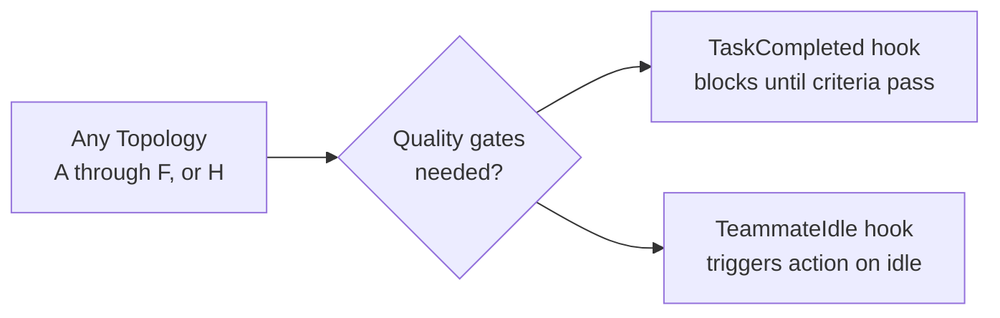

# Decision Tree: Choosing a Topology

Use this tree to pick the right agent team topology for your task.

## Start here: What are you trying to do?

### Understand — explore, investigate, map

{: .highlight }
> - Multiple independent questions? → [Parallel Explorers](../topologies/parallel-explorers/)
> - Ambiguous bug or unclear root cause? → [Competing Hypotheses](../topologies/competing-hypotheses/)
> - One focused question? → Single subagent (no team needed)

### Build — implement, deliver

{: .highlight }
> - Work splits by layer/component into different files? → [Feature Pod](../topologies/feature-pod/)
> - Large backlog of small independent items? → [Task Queue](../topologies/task-queue/)
> - Lead should only coordinate, never code? → [Orchestrator-Only](../topologies/orchestrator-only/)

### Review — audit, critique, validate

{: .highlight }
> - Multiple review perspectives needed? → [Review Board](../topologies/review-board/)
> - Single perspective? → Single subagent with a focused checklist (no team needed)

### Change something risky — refactor, migrate, security

{: .highlight }
> - Expensive to get wrong? → [Risky Refactor](../topologies/risky-refactor/)
> - Standard risk? → Pick the topology that matches the work shape above

### Any topology + quality enforcement

{: .note }
> Need enforced "Definition of Done" criteria? Overlay [Quality-Gated](../topologies/quality-gated/) on top of any topology above.

## Pattern G: Quality-Gated Delivery (composable overlay)

{: .important }
> Pattern G is not a standalone topology -- it layers on top of any other pattern. Apply it when you need enforced "Definition of Done" criteria.



**When to overlay Pattern G:**
- Teammates tend to mark tasks "done" prematurely
- You need automated checks before accepting work
- The cost of rework exceeds the cost of the gate

**Hook example:**

```json
{
  "hooks": {
    "TaskCompleted": [
      {
        "command": "bash -c 'cd $PROJECT_DIR && npm test'",
        "on_failure": "block"
      }
    ]
  }
}
```

## Decision factors at each node

### Independence test
The most important filter. If tasks require constant back-and-forth or touch the same files, agent teams create more problems than they solve. Restructure the decomposition until workers can operate independently.

### Context budget test
Large codebases, verbose logs, and multi-module exploration can exhaust a single context window. Agent teams give each worker its own full context. Subagents are cheaper but return only summaries.

### Risk level
High-risk changes (security, data migrations, core architecture) benefit from independent review and plan-before-execute workflows. Pattern E (Risky Refactor) enforces plan approval before any code changes happen.

## Common combinations

These combinations are examples of **topology composition** -- chaining or nesting primitives. See [Composing Topologies](composing-topologies.md) for full recipes with spawn prompts.

| Scenario | Primary | Overlay |
|---|---|---|
| Ship a full-stack feature with quality checks | D (Feature Pod) | + G (Quality-Gated) |
| Investigate a production bug then fix it | C (Hypotheses) then D (Pod) | + G |
| Review a large PR from multiple angles | B (Review Board) | -- |
| Process 50 small migration tasks | H (Task Queue) | + G |
| Explore unfamiliar codebase before planning | A (Explorers) | -- |
