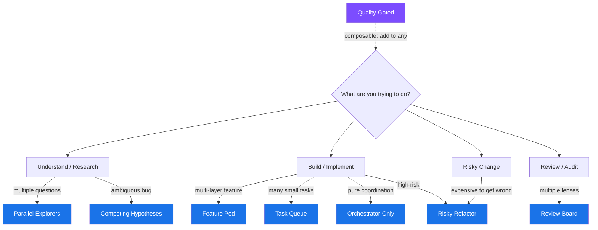

# Agent Team Topologies

**A quick-reference model for structuring multi-agent teams in Claude Code.**
{: .fs-6 .fw-300 }

8 composable topology patterns — a nod to [Team Topologies](https://teamtopologies.com/) thinking, applied to how work flows through agent teams. Browse the patterns, find what fits, and adapt.
{: .fs-5 .fw-300 }

{: .warning }
> **Agent teams are experimental.** They're disabled by default in Claude Code. Enable them by setting `CLAUDE_CODE_EXPERIMENTAL_AGENT_TEAMS` to `1` in your settings or environment. See the [official agent teams documentation](https://docs.anthropic.com/en/docs/claude-code/agent-teams) for setup and known limitations.

[Find Your Topology](docs/decision-tree.md){: .btn .btn-primary .fs-5 .mb-4 .mb-md-0 .mr-2 }
[Getting Started](docs/getting-started.md){: .btn .fs-5 .mb-4 .mb-md-0 .mr-2 }
[View on GitHub](https://github.com/eirwin/agent-team-topologies){: .btn .fs-5 .mb-4 .mb-md-0 }

---

## Pick Your Topology

---

## The 8 Topologies

| Pattern | Best For | Cost |
|---------|----------|------|
| [Parallel Explorers](topologies/parallel-explorers/) | Discovery, research, codebase mapping | **$$** |
| [Review Board](topologies/review-board/) | Code review with distinct lenses | **$$** |
| [Competing Hypotheses](topologies/competing-hypotheses/) | Ambiguous bugs, architectural decisions | **$$$** |
| [Feature Pod](topologies/feature-pod/) | Cross-layer feature delivery | **$$$** |
| [Risky Refactor](topologies/risky-refactor/) | High-risk changes needing plan approval | **$$** |
| [Orchestrator-Only](topologies/orchestrator-only/) | Pure coordination, lead never codes | **$$$$** |
| [Quality-Gated](topologies/quality-gated/) | Enforcing completion standards (composable) | **+$** |
| [Task Queue](topologies/task-queue/) | Many small independent tasks | **$$$$** |

**$$** Low |  **$$$** Medium | **$$$$** High | **+$** Additive overlay
{: .fs-2 .text-grey-dk-000 }

{: .important }
> **Topologies are primitives, not monoliths.** Any teammate slot can itself become a topology -- a reviewer in Feature Pod can spawn a Review Board, an explorer can fan out sub-explorers. See [Composing Topologies](docs/composing-topologies.md) for recipes.

---

## Guides

| Document | What's Inside |
|----------|---------------|
| [Getting Started](docs/getting-started.md) | Enable agent teams, install configs, run your first topology |
| [Mental Model](docs/mental-model.md) | Teams vs subagents, core concepts, selection heuristics |
| [Decision Tree](docs/decision-tree.md) | Expanded flowchart for picking the right topology |
| [Composing Topologies](docs/composing-topologies.md) | Recipes for chaining, nesting, and combining patterns |
| [Anti-Patterns](docs/anti-patterns.md) | 8 things NOT to do with agent teams |
| [Cost Guide](docs/cost-guide.md) | Token economics by topology, cost reduction strategies |
| [Best Practices](docs/best-practices.md) | Operational guidance for running agent teams |

---

## Contributing

See [Contributing](CONTRIBUTING.md) for how to propose new topology patterns, submit real-world examples, and improve agent definitions or hooks.
