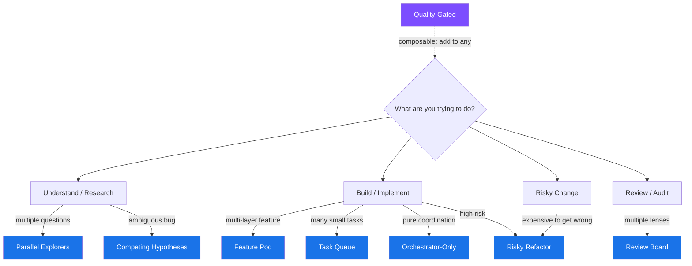

# Agent Team Topologies

**Proven patterns for orchestrating multi-agent teams in Claude Code.**
{: .fs-6 .fw-300 }

8 primitive topology patterns that compose, combine, and nest. Copy-paste spawn prompts and a ready-to-use `.claude/` config directory. Pick a pattern, compose it with others, and go.
{: .fs-5 .fw-300 }

[Get Started](#quick-start){: .btn .btn-primary .fs-5 .mb-4 .mb-md-0 .mr-2 }
[View on GitHub](https://github.com/eirwin/agent-team-topologies){: .btn .fs-5 .mb-4 .mb-md-0 }

---

## Pick Your Topology



---

## Quick Start

{: .note }
> **Copy the `.claude/` directory into your project** to get pre-built agents, a topology chooser skill, and quality gate hooks:
>
> ```bash
> # Clone and copy configs into your project
> git clone https://github.com/eirwin/agent-team-topologies.git
> cp -r agent-team-topologies/.claude/ your-project/.claude/
> ```

You get:
- **6 agent definitions** — explorer, security reviewer, performance reviewer, test reviewer, architect, implementer
- **`/topology` skill** — interactive chooser that recommends a topology based on your goal
- **Hook scripts** — quality gates and idle summary enforcement

---

## The 8 Topologies

| Pattern | Best For | Cost |
|---------|----------|------|
| [Parallel Explorers](topologies/parallel-explorers/) | Discovery, research, codebase mapping | **$$** |
| [Review Board](topologies/review-board/) | Code review with distinct lenses | **$$** |
| [Competing Hypotheses](topologies/competing-hypotheses/) | Ambiguous bugs, architectural decisions | **$$$** |
| [Feature Pod](topologies/feature-pod/) | Cross-layer feature delivery | **$$$** |
| [Risky Refactor](topologies/risky-refactor/) | High-risk changes needing plan approval | **$$** |
| [Orchestrator-Only](topologies/orchestrator-only/) | Pure coordination, lead never codes | **$$$$** |
| [Quality-Gated](topologies/quality-gated/) | Enforcing completion standards (composable) | **+$** |
| [Task Queue](topologies/task-queue/) | Many small independent tasks | **$$$$** |

**$$** Low |  **$$$** Medium | **$$$$** High | **+$** Additive overlay
{: .fs-2 .text-grey-dk-000 }

{: .note }
> **Topologies are primitives, not monoliths.** Any teammate slot can itself become a topology -- a reviewer in Feature Pod can spawn a Review Board, an explorer can fan out sub-explorers. See [Composing Topologies](docs/composing-topologies.md) for recipes.

---

## Guides

| Document | What's Inside |
|----------|---------------|
| [Mental Model](docs/mental-model.md) | Teams vs subagents, core concepts, selection heuristics |
| [Decision Tree](docs/decision-tree.md) | Expanded flowchart for picking the right topology |
| [Anti-Patterns](docs/anti-patterns.md) | 8 things NOT to do with agent teams |
| [Cost Guide](docs/cost-guide.md) | Token economics by topology, cost reduction strategies |
| [Best Practices](docs/best-practices.md) | Operational guidance for running agent teams |
| [Composing Topologies](docs/composing-topologies.md) | Recipes for chaining, nesting, and combining patterns |

---

## What's in `.claude/`

```
.claude/
├── agents/
│   ├── explorer.md          # Read-only codebase discovery
│   ├── security-reviewer.md # OWASP-informed security review
│   ├── perf-reviewer.md     # Performance analysis
│   ├── test-reviewer.md     # Test coverage & correctness
│   ├── architect.md         # Plan-mode architecture design
│   └── implementer.md       # Focused code execution
├── skills/
│   └── topology/
│       └── SKILL.md         # /topology interactive chooser
└── hooks/
    ├── quality-gate.sh      # Block task completion if tests/lint fail
    ├── idle-summary.sh      # Require structured summary before idle
    └── README.md            # Hook installation guide
```

---

## Contributing

See [Contributing](CONTRIBUTING.md) for how to propose new topology patterns, submit real-world examples, and improve agent definitions or hooks.
