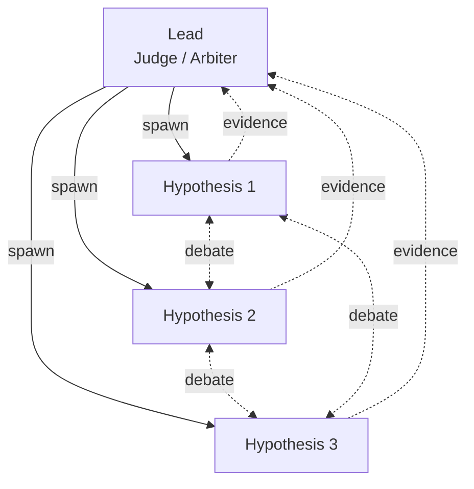

# Competing Hypotheses
> Multiple investigators propose, test, and disprove theories like a scientific debate.

## At a Glance
| Field | Value |
|-------|-------|
| Best For | Ambiguous bugs, flaky tests, architectural decisions, root cause analysis |
| Team Shape | Lead (judge/arbiter) + 3-6 Investigators |
| Cost Profile | $$$ -- higher (debate rounds consume tokens) |
| Complexity | Medium |
| Parallelism | Medium |

Medium Complexity
{: .label .label-yellow }
$$$ Cost
{: .label .label-yellow }
Medium Parallelism
{: .label .label-blue }

## When to Use
- A bug is ambiguous and the root cause is unclear
- Flaky or intermittent behavior defies simple reproduction
- You need to choose between multiple architectural approaches with real trade-offs
- You want to counter anchoring bias by forcing divergent investigation paths

## When NOT to Use
- The root cause is obvious and just needs fixing
- The decision has a clear "right answer" that does not require debate
- Cost is a primary concern -- debate rounds are token-intensive

## How It Works
Each investigator proposes a hypothesis and a test plan to validate or disprove it. Investigators are encouraged to actively disprove each other's theories, creating a structured debate. The lead acts as final arbiter, evaluating the evidence and declaring a consensus root cause or decision.



1. **Lead** describes the symptom and spawns investigators
2. Each **Investigator** proposes: hypothesis, test plan, predicted observations, disproof criteria
3. Investigators exchange messages to **actively disprove** each other's theories
4. **Lead** evaluates the surviving hypothesis and declares: consensus root cause, reproducer, fix plan, verification steps

## Spawn Prompt
```text
Users report: "<symptom>".
Spawn 5 teammates to investigate different hypotheses.
Have them talk to each other to disprove each other's theories like a scientific debate.
End with: (1) consensus root cause, (2) reproducer, (3) fix plan, (4) verification steps.
```

## Task Breakdown Strategy
Structure tasks around the **hypothesis lifecycle**, not code modules:
1. **Hypothesis formation:** Each investigator proposes a distinct theory
2. **Evidence gathering:** Each investigator collects supporting and contradicting evidence
3. **Cross-examination:** Investigators challenge each other's evidence
4. **Convergence:** Surviving hypotheses are refined into a consensus

Use task list dependencies so that "Fix" tasks only unblock after "Root cause confirmed" tasks complete.

## Configuration
- **Agents:** Use `investigator.md` agent definitions with instructions to propose and disprove
- **Hooks:** Use task dependencies to gate fix tasks behind confirmed root cause
- **Team size:** 3-6 investigators; more hypotheses increase coverage but also cost and debate complexity

## Variations
- **Architecture Decision variant:** Instead of debugging, each investigator champions a different design approach and argues for it
- **Red Team variant:** One investigator is explicitly assigned to attack and disprove every other hypothesis
- **Time-boxed variant:** Limit debate rounds to control cost -- after N rounds, the lead forces a decision
- **Pipeline variant:** Debate concludes with a root cause or decision, which flows into a [Risky Refactor](../risky-refactor/) for controlled execution. See [Composing Topologies](../../docs/composing-topologies.md#recipe-4-competing-hypotheses--risky-refactor)

## Trade-offs
**Pros:**
- Counters anchoring bias by forcing multiple investigation paths
- Cross-examination catches weak evidence and flawed reasoning
- Structured debate produces high-confidence conclusions
- Works well for problems where "the obvious answer" is often wrong

**Cons:**
- Token-intensive due to inter-agent messaging and debate rounds
- Requires clear facilitation from the lead to prevent circular arguments
- Medium parallelism -- investigators need to read each other's findings
- Overkill for straightforward bugs with clear symptoms

## Related Patterns
- [Parallel Explorers](../parallel-explorers/) -- when you need discovery without the debate overhead
- [Risky Refactor](../risky-refactor/) -- when the debate concludes and the fix needs careful execution
- [Quality-Gated](../quality-gated/) -- layer on top to ensure debate conclusions meet evidence standards
