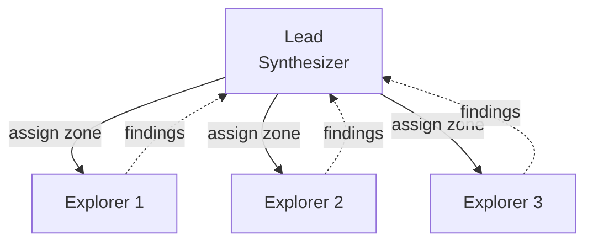

# Parallel Explorers
> Fan-out discovery across a codebase, then synthesize findings into a unified picture.

## At a Glance

| Field | Value |
|-------|-------|
| Best For | Fast discovery, codebase mapping, architecture understanding |
| Team Shape | Lead (synthesizer) + 2-4 Explorers |
| Cost Profile | Low (small team, read-heavy) |
| Complexity | Low |
| Parallelism | High |

Low Complexity
{: .label .label-green }
Low Cost
{: .label .label-green }
High Parallelism
{: .label .label-blue }

## When to Use
- You need to understand an unfamiliar codebase quickly
- You want to map architecture, data flows, or module boundaries
- Multiple independent questions need answering simultaneously ("where does auth live?", "how is state managed?", "what does the test suite cover?")
- The codebase is large enough that a single agent would exhaust its context window exploring it

## When NOT to Use
- The question is narrow and a single agent can answer it directly
- You need to make changes, not just understand code -- use Feature Pod or Task Queue instead
- The codebase is small enough that one agent can hold all of it in context

## How It Works
Each explorer is assigned a distinct area or question to investigate. They work independently, scanning files and tracing flows within their assigned scope. Each reports structured findings back to the lead, who synthesizes everything into a coherent picture.



1. **Lead** breaks the exploration into non-overlapping zones (by module, layer, or question)
2. **Explorers** each dive into their assigned area and produce a structured summary
3. **Lead** collects all summaries and synthesizes a unified view

## Spawn Prompt
```text
Create an agent team to map how <system> works.
Spawn 3 teammates:
- Explorer A: trace the request flow end-to-end; list key files + sequence.
- Explorer B: identify data model + persistence; list tables/schemas + key APIs.
- Explorer C: find known pitfalls/tests/edge cases; summarize risks + existing coverage.
Have each deliver: 10 bullets + the 8 most important files/paths. Then synthesize.
```

## Task Breakdown Strategy
Split by **module boundary** or **question boundary**, not by file. Each explorer should own a coherent slice of the system:
- By module: "auth subsystem", "database layer", "UI state management"
- By question: "how does data flow?", "where are the failure modes?", "what is the test strategy?"

Keep deliverables crisp: bullet summaries + key file paths. Avoid open-ended "explore everything" tasks.

## Configuration
- **Agents:** Use `explorer.md` agent definitions with read-only, research-focused instructions
- **Hooks:** No special hooks required -- this is a read-only topology
- **Team size:** 2-4 explorers is the sweet spot; more than 4 rarely adds value and increases cost

## Variations
- **Deep Dive variant:** Instead of breadth-first mapping, have each explorer go deep on a single subsystem, producing detailed documentation
- **Audit variant:** Explorers map the codebase, then findings feed into a [Review Board](../review-board/) or [Competing Hypotheses](../competing-hypotheses/) for deeper analysis. See [Composing Topologies](../../docs/composing-topologies.md)
- **Incremental variant:** Run in rounds -- first pass maps the surface, second pass digs into areas flagged as complex or risky

## Trade-offs
**Pros:**
- Fast parallel discovery across large codebases
- Each explorer gets a clean context window, avoiding context pollution
- Low coordination overhead -- explorers work independently
- Cost-effective for read-only research

**Cons:**
- Synthesis step can miss connections between areas that different explorers investigated
- Duplicate work possible if boundaries are not drawn clearly
- Read-only -- does not produce code changes directly

## Related Patterns
- [Review Board](../review-board/) -- similar fan-out structure but focused on critique rather than discovery
- [Competing Hypotheses](../competing-hypotheses/) -- when exploration reveals ambiguity that needs debate
- [Orchestrator-Only](../orchestrator-only/) -- for sustained coordination across many workers
