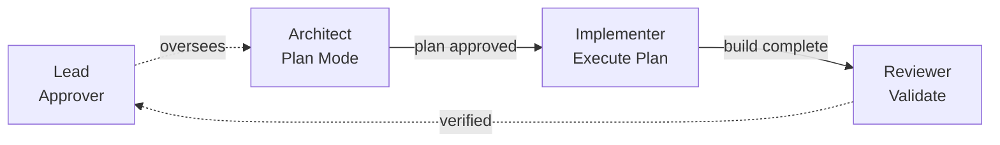

# Risky Refactor
> High-risk changes gated through plan approval, sequential execution, and independent review.

## At a Glance

| Field | Value |
|-------|-------|
| Best For | Security-sensitive changes, large refactors, database migrations, core architecture changes |
| Team Shape | Lead (approver) + Architect + Implementer + Reviewer |
| Cost Profile | $$ -- moderate (sequential reduces parallel burn) |
| Complexity | Medium-High |
| Parallelism | Low (sequential by design) |

Medium-High Complexity
{: .label .label-yellow }
$$ Cost
{: .label .label-green }
Low Parallelism
{: .label .label-red }

## When to Use
- The change has a high blast radius (touches core systems, auth, data models)
- Getting it wrong is expensive or hard to reverse
- You want a human-in-the-loop approval gate before implementation begins
- The change benefits from separating planning from execution

## When NOT to Use
- The change is low-risk and can be made directly
- Speed matters more than safety -- sequential gates slow things down
- The scope is small enough that planning and implementation can happen in one step

## How It Works
The architect produces a detailed plan in read-only plan mode. The lead reviews and approves (or rejects with feedback). Only after approval does the implementer execute the plan. A separate reviewer then validates the result against the original plan and acceptance criteria.



1. **Architect** analyzes the codebase and produces a plan (in plan mode -- read-only until approved)
2. **Lead** reviews the plan against approval criteria (tests included, rollback plan, risk analysis)
3. On approval, **Implementer** executes the plan
4. **Reviewer** validates the implementation against the plan and acceptance criteria

## Spawn Prompt
```text
Spawn an architect teammate to refactor <module>.
Require plan approval before they make any changes.
Approval criteria: include tests, rollback plan, and risk analysis.
After approval, spawn an implementer + a reviewer to execute the plan.
```

## Task Breakdown Strategy
Break into **sequential gates**, each blocking the next:
1. **Analysis task:** Architect maps the current state, identifies risks, and scopes the change
2. **Plan task:** Architect produces a detailed plan with rollback strategy and test plan
3. **Approval gate:** Lead reviews and approves (or sends back with feedback)
4. **Implementation task:** Implementer executes the approved plan in minimal safe slices
5. **Review task:** Reviewer validates against plan, runs tests, checks for regressions
6. **Verification task:** Final end-to-end validation

## Configuration
- **Agents:** Use `architect.md` (plan mode required), `implementer.md`, and `reviewer.md` agent definitions
- **Hooks:** Enable plan approval requirement for the architect; use `TaskCompleted` hooks to enforce test passage
- **Team size:** 4 (lead + architect + implementer + reviewer); the architect and reviewer can be the same agent in smaller scopes

## Variations
- **Minimal-slice variant:** Instead of one big implementation, break into multiple small slices, each going through its own approval gate
- **Pair-programming variant:** Implementer and reviewer work in lockstep, with the reviewer checking each commit
- **Rollback-first variant:** Implementer writes the rollback mechanism first, then proceeds with the change
- **Investigation-first variant:** Preceded by [Competing Hypotheses](../competing-hypotheses/) to establish the root cause before planning the fix. See [Composing Topologies](../../docs/composing-topologies.md#recipe-4-competing-hypotheses--risky-refactor)

## Trade-offs
**Pros:**
- Sequential gates catch problems before they compound
- Plan approval creates a natural checkpoint for human oversight
- Separation of planning and execution reduces bias
- Lower parallel cost -- only one agent active at a time

**Cons:**
- Slowest topology due to sequential execution
- Architect may produce plans that are hard to implement exactly as written
- Multiple handoffs can lose context between stages
- Overkill for low-risk changes

## Related Patterns
- [Competing Hypotheses](../competing-hypotheses/) -- when the refactor approach itself is unclear and needs debate
- [Review Board](../review-board/) -- for post-implementation review with multiple lenses
- [Quality-Gated](../quality-gated/) -- layer on to enforce gate criteria via hooks
