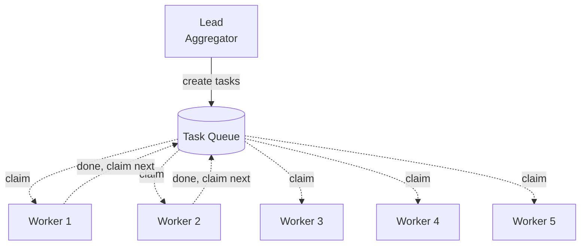

# Task Queue
> Many workers self-claim from a shared pool of small, independent tasks.

## At a Glance

| Field | Value |
|-------|-------|
| Best For | Bulk processing, many small fixes, ticket triage, doc extraction, independent work items |
| Team Shape | Lead (aggregator) + 3-8 Workers |
| Cost Profile | High (many parallel workers) |
| Complexity | Low |
| Parallelism | Very High |

Low Complexity
{: .label .label-green }
High Cost
{: .label .label-red }
Very High Parallelism
{: .label .label-blue }

## When to Use
- You have a backlog of many small, independent work items
- Each item is self-contained and does not depend on others
- You want maximum throughput on a large volume of tasks
- Items are similar in shape (bulk edits, migrations, extractions, triage)

## When NOT to Use
- Tasks have complex dependencies on each other -- use Feature Pod or Orchestrator-Only
- There are only a few tasks -- the overhead of spawning many workers is not worth it
- Tasks require deep, sustained context -- each worker starts fresh on each task

## How It Works
The lead creates a large pool of small, independent tasks in the shared task list. Workers self-claim the next unblocked task, complete it, and immediately grab the next one. File locking prevents race conditions on task claims. The lead monitors progress and aggregates results.



1. **Lead** creates a pool of small, self-contained tasks with clear acceptance criteria
2. **Workers** self-claim the next unblocked task from the shared task list
3. On completion, each worker immediately claims the next available task
4. **Lead** monitors progress, handles edge cases, and aggregates final results

## Spawn Prompt
```text
Create an agent team to process this backlog of tasks:
1) ...
2) ...
3) ...
Break them into small, independent items with clear acceptance criteria.
Let teammates self-claim the next unblocked task after finishing.
I want brief status updates per completed task + a final summary.
```

## Task Breakdown Strategy
Express work as **many small, self-contained tasks**:
- Each task should be completable without knowledge of other tasks
- Include clear acceptance criteria in every task description
- Avoid overlapping file edits across tasks
- Keep tasks roughly similar in size for even distribution across workers
- Use task dependencies sparingly -- the goal is maximum parallelism

## Configuration
- **Agents:** Use generic `worker.md` agent definitions; workers should be interchangeable
- **Hooks:** Use `TaskCompleted` hooks to validate each completed item; use `TeammateIdle` to trigger cleanup or summary when all tasks are done
- **Team size:** 3-8 workers; more workers increase throughput but also cost and lead coordination overhead

## Variations
- **Priority queue variant:** Tasks are ordered by priority; workers always claim the highest-priority unblocked task
- **Specialist queue variant:** Different task types route to specialist workers (similar to Orchestrator-Only but with a shared queue)
- **Batch variant:** Workers claim small batches of related tasks instead of single items
- **Progressive variant:** Lead adds new tasks to the queue as workers surface findings or edge cases

## Trade-offs
**Pros:**
- Very high throughput for independent work items
- Self-claim with file locking prevents race conditions
- Workers are interchangeable -- easy to scale up or down
- Low coordination overhead per task (tasks are self-contained)

**Cons:**
- High cost due to many parallel workers
- Not suitable for interdependent tasks
- Each worker starts fresh on each task -- no shared context across tasks
- Lead must invest upfront in creating a well-structured task backlog

## Related Patterns
- [Orchestrator-Only](../orchestrator-only/) -- when tasks have complex dependencies that need active coordination
- [Quality-Gated](../quality-gated/) -- layer on to enforce per-task completion standards
- [Parallel Explorers](../parallel-explorers/) -- when the work is research rather than execution
